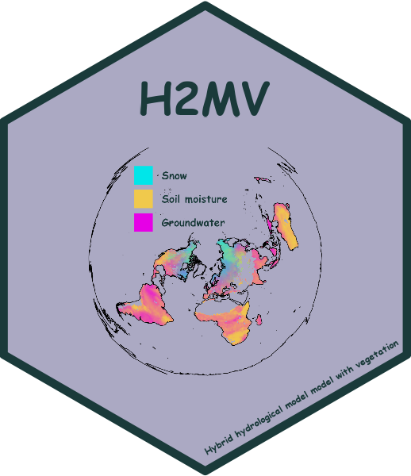

# H2MV 

**Global physically constrained deep learning water cycle model with vegetation**

This repository implements the H2MV model as described in the peer‑reviewed study:

Baghirov, Z., Jung, M., Reichstein, M., Körner, M., and Kraft, B.: H2MV (v1.0): global physically constrained deep learning water cycle model with vegetation, Geoscientific Model Development, 18, 2921–2943, https://doi.org/10.5194/gmd-18-2921-2025 2025.


H2MV combines process‑based physics with deep learning to simulate the terrestrial water cycle and its interactions with vegetation under global constraints.

## 🚀 Key Features

- Hybrid physics‑ML architecture: Integrates conceptual process models (mass balance, hydrology, vegetation dynamics) with neural networks to learn uncertain parameterizations from data.

- Physically constrained: Enforces mass‑balance and conservation laws at every time step, ensuring realistic and interpretable outputs.

- Vegetation coupling: Explicitly models plant–water interactions, including soil moisture dynamics, evapotranspiration, and vegetation feedbacks.

- Modular and extensible: Easily add or replace components (new physics modules, datasets, neural architectures) without rewriting core code.

- End‑to‑end reproducibility: Compatible with both pip and Conda environments; scripts provided for efficient training on local or Slurm clusters.

## 📂 Repository Structure

```text
├── datasets/                  # PyTorch Dataset wrappers & data loader utils
│   ├── ZarrDataset.py         # Manages training/validation/testing splits
│   ├── helpers_loading.py     # Functions to load raw data into ZarrDataset
│   └── helpers_preprocessing.py # Preprocessing utilities for ZarrDataset
│
├── models/                    # Model architectures & training scripts
│   ├── hybrid/                # High‑level hybrid model implementation
│   │   ├── cv_helpers.py         # k‑fold cross‑validation routines
│   │   ├── hybrid_H2O.py         # Core H2MV model (PyTorch Lightning)
│   │   ├── hybrid_H2O_common_step.py  # Shared validation/testing steps
│   │   ├── hybrid_H2O_training_step.py # Training step definitions
│   │   ├── hybrid_helpers.py      # Forward‑pass helper functions
│   │   ├── train_model.py         # Training driver script (cross‑validation)
│   │   └── run_parallel_slurm.sh  # Slurm script for 10‑fold CV
│   │
│   ├── neural_networks/       # Low‑level neural network definitions
│   │   └── neural_networks.py
│   │
│   └── physics/               # Process‑based modules for water cycle
│       ├── evapotranspiration.py    # Evaporation & transpiration processes
│       ├── gw_storage.py            # Groundwater storage dynamics
│       ├── runoff.py                # Surface runoff & baseflow
│       ├── snow.py                  # Snowpack accumulation & melt
│       ├── soil_gw_recharge.py      # Soil‑groundwater recharge
│       ├── soil_moisture.py         # Soil moisture balance
│       ├── tws.py                   # Terrestrial water storage summary
│       └── water_cycle_forward.py   # Single‑timestep forward integration
│
├── equifinality/             # Post‑training equifinality analysis
│   └── equifinality.py       # Quantify parameter equifinality
│
├── requirements.txt          # Python dependencies (pip)
├── environment.yml           # Conda environment specification
└── README.md                 # Project overview & instructions
```

## 🔄 Reproducibility

All required packages are listed in requirements.txt / environment.yml.

A CUDA‑enabled GPU is strongly recommended for efficient training and inference; CPU‑only runs have not been tested and will probably be substantially slower.

## 🚀 Quick Start

The following assumes access to a Slurm cluster with GPU nodes. (If you don’t have Slurm, see the note at the end.)

```
# 1. Install Python dependencies
pip install -r requirements.txt

# 2. Set your custom paths
#    - In models/hybrid/train_model.py:
#        Replace "..." with:
#          - your Zarr dataset path (zarr_data_path)
#          - your desired model output directory (dir_trained_models)
#
#    - In models/hybrid/run_parallel_slurm.sh:
#        Replace "..." in the log/output path and Python call
#        with your environment's actual paths

# 3. Launch training via Slurm (10-fold cross-validation)
sbatch models/hybrid/run_parallel_slurm.sh
```

🖥️ Running Locally (without Slurm)?

If you don’t have access to Slurm, you can run training manually for each fold (note: this pathway hasn’t been extensively tested yet):

```
# Example: training fold 0
python models/hybrid/train_model.py 0
```

Need help? Reach out via the Contact section below.

## 🤝 Contributing

We warmly welcome contributions, suggestions, and ideas! Whether it’s:

* Bug reports & issues: Open an issue to let us know what’s not working or could be improved.

* Feature requests: Suggest new data sources, physics processes, or neural network architectures.

* Pull requests: Fork the repo, make changes on a branch, and submit a pull request.

* Collaboration: If you’re interested in joint research or community development, please get in touch!

## Citation

BibTex:

```text
@article{Baghirov2025,
  title = {H2MV (v1.0): global physically constrained deep learning water cycle model with vegetation},
  volume = {18},
  ISSN = {1991-9603},
  url = {http://dx.doi.org/10.5194/gmd-18-2921-2025},
  DOI = {10.5194/gmd-18-2921-2025},
  number = {10},
  journal = {Geoscientific Model Development},
  publisher = {Copernicus GmbH},
  author = {Baghirov,  Zavud and Jung,  Martin and Reichstein,  Markus and K\"{o}rner,  Marco and Kraft,  Basil},
  year = {2025},
  month = may,
  pages = {2921–2943}
}
```

## 📬 Contact

* Issues & Pull Requests: https://github.com/zavud/h2mv/issues

* Email: zbaghirov@bgc-jena.mpg.de

Thank you for your interest in H2MV!